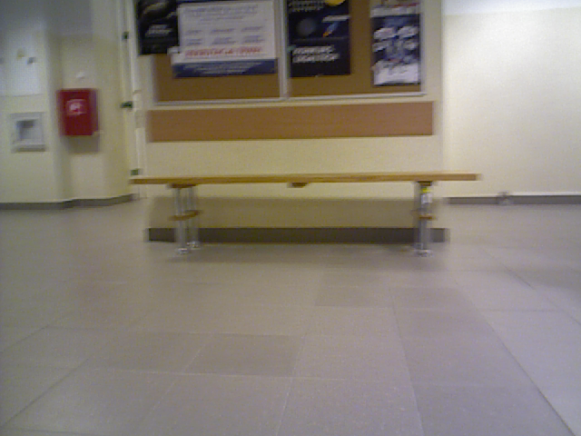
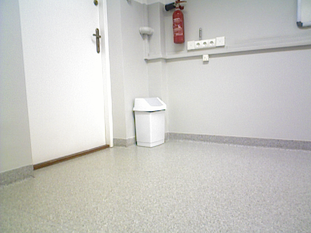

# Only Look Once
Distinctive landmarks mining from ConvNet for visual place recognition task.

Project was based on [IROS2017_OnlyLookOnce](https://github.com/scutzetao/IROS2017_OnlyLookOnce) repository.

## Dataset 
Nao dataset is available [here](https://drive.google.com/drive/folders/1mt4A1wLuArsKAHy6wMDSUDQcgIj-wz8m). 


## Setup

1. Install python 3 and libraries from requirements.txt

2. Copy image you want to localize to 'example_images' directory

3. Run demo.py as follows
```
python demo.py <image_name>
```

## Results 
Input image:



Output: 

``` bash
Possible places:
Corridor1_1
```

Input image:




Output: 

``` bash
Possible places:
F102_2
```


## Authors
Anna Świadek<br>
Filip Zybała<br>
Aleksandra Pestka<br>

AGH UST 2021
